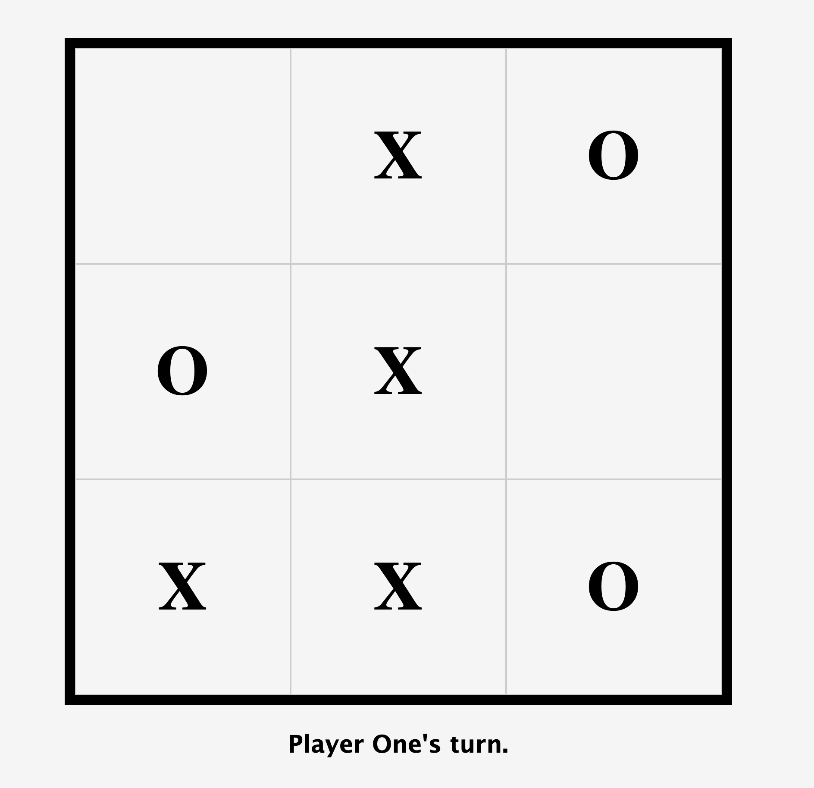
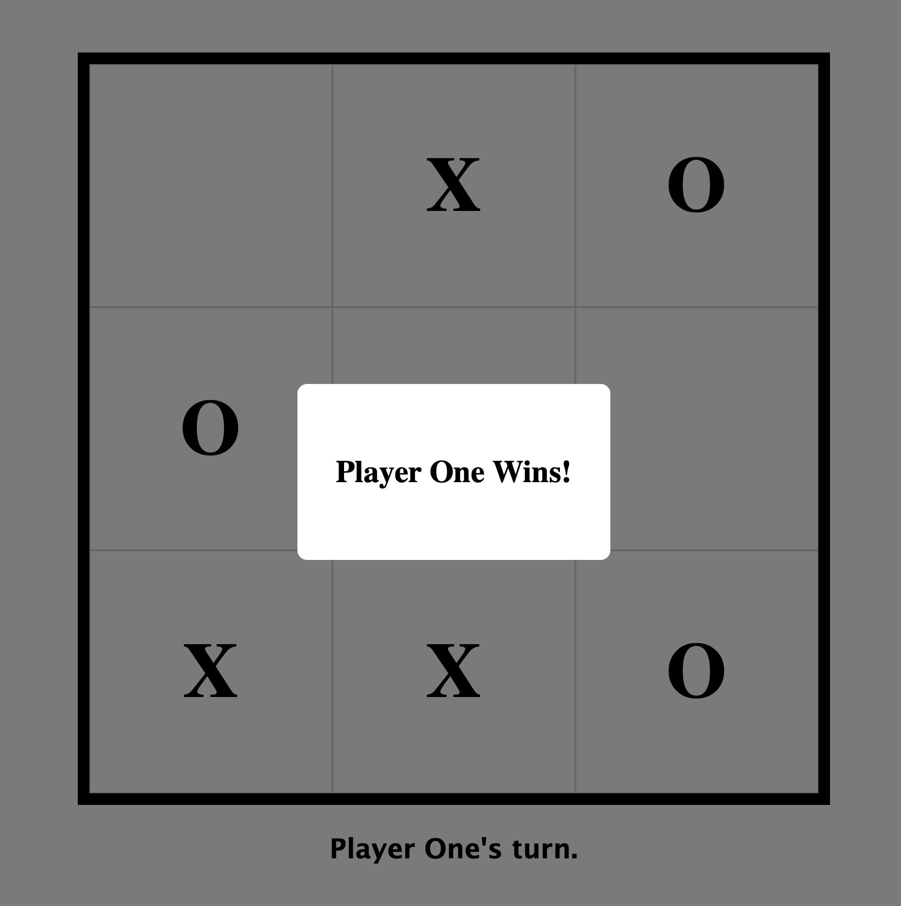

# Tic-Tac-Toe

A classic Tic-Tac-Toe game built with vanilla JavaScript, HTML, and CSS.

<div align="center">
  
  
</div>

## Live Demo

[Play the game here](https://thechosen-1.github.io/Tic-Tac-Toe/)

## Features

- Two-player gameplay (X and O)
- Win detection for rows, columns, and diagonals
- Tie detection when all cells are filled
- Interactive UI with hover animations
- Popup message displaying the winner or tie result
- Clean, responsive design

## Technologies Used

- HTML5
- CSS3 (Grid, Flexbox, Animations)
- Vanilla JavaScript (Factory Functions, Module Pattern)

## How to Play

1. Player One (X) starts the game
2. Click on any empty cell to place your mark
3. Players alternate turns
4. First player to get three marks in a row (horizontally, vertically, or diagonally) wins
5. If all cells are filled with no winner, the game ends in a tie
6. Click outside the popup to dismiss it

## Project Structure

```
├── index.html    # Main HTML structure
├── styles.css    # Styling and animations
├── scripts.js    # Game logic and DOM manipulation
└── README.md     # Project documentation
```

## Learning Objectives

This project was created as an exercise in my learning journey of full-stack development from [The Odin Project](https://www.theodinproject.com/). Key concepts practiced:

- Factory functions and closures
- Module pattern for code organization
- DOM manipulation and event handling
- CSS Grid for game board layout
- Game state management

## Screenshots


## License

This project is open source and available under the MIT License.
